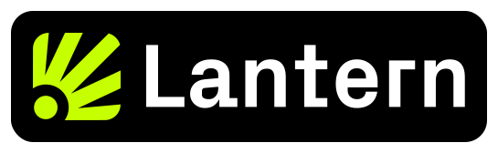

<p align="center">
  
</p>

<p align="center">
  <a href="https://github.com/bitminetech/lantern/actions/workflows/ci.yml"></a>
  <a href="https://hub.docker.com/r/piertwo/lantern"></a>
  <a href="https://hub.docker.com/r/piertwo/lantern"></a>
</p>

<p align="center">
  Lantern is a post-quantum client of <a href="https://github.com/leanEthereum/leanSpec.git">Lean Consensus</a> for Ethereum.
</p>

## Requirements

Make sure you have the following tools installed before building.

- CMake 3.20+
- C compiler
- [Rust](https://www.rust-lang.org/tools/install) (for XMSS bindings)
- [uv](https://docs.astral.sh/uv/) (to generate leanSpec fixtures)

## Bootstrap

Initialize Lantern's submodules before generating fixtures or building from a fresh checkout.

```sh
./scripts/bootstrap.sh
```

To bootstrap and generate the leanSpec consensus fixtures in one step:

```sh
./scripts/bootstrap.sh --fixtures
```

## Build

Configure and compile the project with CMake.

```sh
cmake -S . -B build
cmake --build build --parallel
```

## Test

Run the test suite to verify everything works correctly.

```sh
ctest --test-dir build --output-on-failure
```

Fixture-driven consensus executables are only registered when generated leanSpec fixtures are present under
`tools/leanSpec/fixtures/consensus`. A fresh checkout without generated consensus fixtures will still build and run the
unit-test suite.

## Regenerating Fixtures

Lantern generates consensus fixtures on demand from the `tools/leanSpec` submodule instead of committing the JSON
snapshots into this repository.

Consensus fixtures:

```sh
cmake -S . -B build
cmake --build build --target fixtures
```

That command runs `uv run fill --fork=Devnet --clean -n auto` inside `tools/leanSpec` and leaves the generated JSONs
under `tools/leanSpec/fixtures/consensus`.

For a one-shot bootstrap that also generates the consensus fixtures, run:

```sh
./scripts/bootstrap.sh --fixtures
```

If you need to point CMake at a different downloaded fixture tree, configure with
`-DLANTERN_CONSENSUS_FIXTURE_DIR=/path/to/consensus`.

## License

MIT — see [LICENSE](LICENSE).
